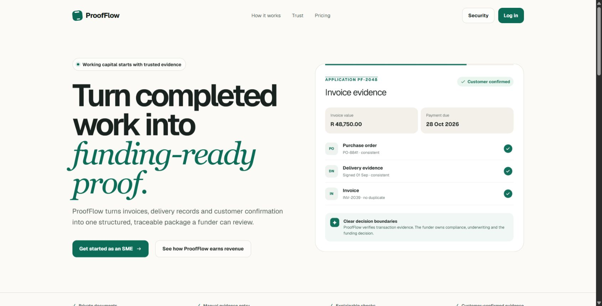
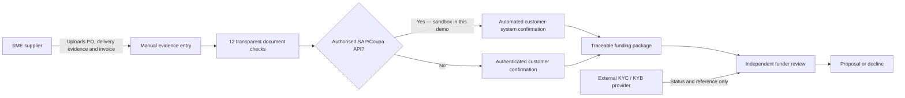
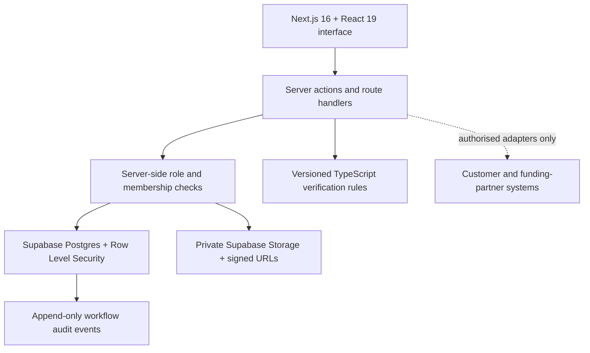
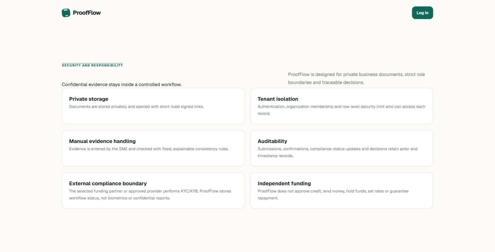

# ProofFlow

### Funding starts with evidence everyone can trust.

[](https://github.com/Baraka-kileo/proofflow/actions/workflows/ci.yml)
[](https://proofflow-sepia.vercel.app)
[](https://nextjs.org/)
[](https://www.typescriptlang.org/)

ProofFlow is a privacy-first evidence workflow for invoice finance. It turns a purchase order, delivery evidence, an invoice and either automated SAP/Coupa confirmation or authenticated customer confirmation into one structured, traceable package that a funding partner can independently review.

**[Watch the 2:58 product tour](https://github.com/user-attachments/assets/b4ef8e59-7ca4-4a71-a998-732fc997e341)** · **[Open the live application](https://proofflow-sepia.vercel.app)** · **[Judge's guide](docs/JUDGING-GUIDE.md)** · **[Visual feature guide](docs/FEATURE-GUIDE.md)** · **[Documentation index](docs/README.md)**



> **Decision boundary:** ProofFlow verifies transaction evidence. It does not perform KYC/KYB, approve credit, lend money, set rates, hold funds or guarantee repayment.

## Watch ProofFlow in under three minutes

https://github.com/user-attachments/assets/b4ef8e59-7ca4-4a71-a998-732fc997e341

The narrated tour shows the SME evidence journey, understandable document checks, both customer-confirmation paths, the signed confirmation certificate and independent funder review. **[Open the video in a new tab](https://github.com/user-attachments/assets/b4ef8e59-7ca4-4a71-a998-732fc997e341).**

The tour uses fictional records created for testing. It demonstrates the working product and its responsibility boundaries; it does not claim a live bank, SAP, Coupa or KYC-provider connection.

## ProofFlow at a glance

| Who | What they do | What they receive |
|---|---|---|
| **SME supplier** | Uploads the purchase order, delivery evidence and invoice, then enters the important facts | A checked, traceable application and reusable Trust Passport |
| **Large customer** | Uses authorised SAP/Coupa records for automated confirmation, or confirms and disputes facts through the secure workspace | A traceable system or signed confirmation certificate |
| **Funding partner** | Reviews the original evidence, completes KYC/KYB and underwriting externally, then proposes or declines | One decision-ready evidence package with a complete activity trail |

ProofFlow prepares trusted evidence. **The regulated funding partner owns the risk and makes the funding decision.**

## The problem

An SME may have completed real work and issued a valid invoice, yet still wait weeks for payment. A potential funder cannot responsibly act on an invoice alone: the purchase order, delivery, invoice and buyer acknowledgement must agree, while confidential documents must remain controlled. The resulting manual back-and-forth is slow for the SME and expensive to review.

ProofFlow creates a shared evidence trail without pretending to replace regulated judgement:

- the **SME** uploads three private documents, enters 21 required facts and makes a declaration;
- **ProofFlow** runs 12 transparent checks across names, references, currency, amounts, arithmetic, dates, delivery acknowledgement and duplicates;
- the **large customer** confirms the transaction automatically through authorised SAP/Coupa records, or manually through the authenticated workspace;
- the **funding partner** performs KYC/KYB and underwriting externally, then records its independent proposal or decline.

## Judge fast path

Allow about five minutes. No local setup is needed:

1. Watch the [2:58 narrated product tour](https://github.com/user-attachments/assets/b4ef8e59-7ca4-4a71-a998-732fc997e341).
2. Open the [live application](https://proofflow-sepia.vercel.app) and select **Log in**.
3. Use the **Sample credentials for testing** panel to enter as the SME, large customer or funder. Selecting a role fills the form but never signs in automatically.
4. Inspect the SME evidence checks and Trust Passport, the customer's confirmation history and certificate, and the funder's proposal or decline workspace.
5. Review the public [security page](https://proofflow-sepia.vercel.app/security) and the [judging evidence map](docs/JUDGING-GUIDE.md).

All hosted records are fictional. They exercise the same role-based workflow as any other account; there is no separate simulation product.

## How the workflow works



### Responsibility by stage

| Stage | Accountable party | What ProofFlow does |
|---|---|---|
| Evidence submission | SME | Private upload, structured manual entry and declaration |
| Evidence checking | ProofFlow | Compares names, references, amounts, dates, delivery acknowledgement and duplicates, then records the result |
| Transaction confirmation | Large customer | Automates matching through authorised SAP/Coupa records, with authenticated confirmation as the fallback |
| KYC/KYB and AML | Funder or approved provider | Stores only workflow status and an external reference |
| Credit, pricing and underwriting | Funding partner | Presents evidence; never makes or disguises the decision |
| Contracting and disbursement | Funding partner | Waits for a future authorised confirmation; never fabricates money movement |

## What is innovative

ProofFlow combines automated evidence confirmation, a shared multi-party workflow and a clear trust boundary:

- **Automated confirmation through systems companies already use.** Large customers commonly manage purchase orders, invoices, deliveries and payment status in SAP or Coupa. ProofFlow's read-only API adapter compares those records with the SME's evidence: a match creates a traceable system confirmation and certificate; a mismatch goes to human review; and no connection falls back to secure customer confirmation.
- **Two trustworthy certificate paths.** A manual confirmation certificate records the authorised representative, corporate email, role, six confirmed facts, captured signature, signing time and approval ID. An automated confirmation certificate records the connected system, evidence checks, retrieval time and evidence identity without inventing a human signature.
- **Evidence lineage, not a black-box score.** Each entered fact retains its source document, actor and timestamp.
- **Explainable checks.** Every result shows the compared values and why it passed, needs review or failed rather than returning an opaque score.
- **Privacy-minimising design.** Sensitive files are not sent to an AI service; KYC/KYB documents and screening reasoning remain with the regulated party.
- **No manufactured certainty.** Missing integrations fail closed and route to authenticated confirmation. “Evidence verified” never becomes “funding approved.”
- **One product, three perspectives.** SME, customer and funder views share the same application and audit history while enforcing different permissions.

> **Integration status:** SAP/Coupa is demonstrated with fictional sandbox data. No production customer tenant or live OAuth credentials are connected. Production activation requires customer authorisation, restricted read-only access, security and privacy review, monitoring and signed agreements.

See the complete [judging-criteria evidence map](docs/JUDGING-GUIDE.md).

## Technical architecture



| Layer | Choice | Why it fits |
|---|---|---|
| Web application | Next.js 16, React 19, TypeScript | One responsive application with server-rendered public and protected role views |
| Identity and data | Supabase Auth and PostgreSQL | Authenticated sessions, relational evidence lineage and transactional writes |
| Authorisation | Server checks plus Row Level Security | Defence in depth across organization and role boundaries |
| Documents | Private Supabase Storage | Controlled paths and short-lived signed access rather than public URLs |
| Validation | Zod plus database constraints | Complete payload validation before atomic persistence |
| Evidence checks | Published TypeScript comparisons | The same 12 checks run every time and show the values and reason a person can challenge |
| Enterprise integration | Provider-neutral adapter with SAP/Coupa sandbox boundary | Keeps test data clearly simulated and activates live read-only access only after enterprise authorization |
| Delivery | Vercel and GitHub Actions | Reproducible production builds and automated quality gates |

Historical database names relating to earlier prototypes remain only where required for migration compatibility. The application contains no AI processing. SAP/Coupa data shown for the hackathon is fictional sandbox data; live enterprise access remains disabled until an authorised customer connection is configured.

## Security and privacy



Key implemented controls include server-enforced role checks, tenant Row Level Security, private object storage, expiring signed URLs, file validation, SHA-256 duplicate detection, atomic manual-evidence submission and traceable state changes. Integrations fail closed. ProofFlow records external compliance workflow metadata but does not collect biometrics or confidential screening reports.

This is a hackathon MVP, not a claim of regulatory certification. Independent penetration testing, legal/privacy review, operational monitoring, retention controls and incident-response rehearsal are required before onboarding real organizations. Read the [threat model and control matrix](docs/SECURITY.md).

## Business model

ProofFlow starts with one simple performance-based fee. SMEs and large customers use the evidence and confirmation journey for free. A funding partner pays only when an opportunity introduced through ProofFlow is successfully funded.

| Participant | Price | Value |
|---|---:|---|
| **SME** | Free | Evidence submission, 12 transparent checks, customer confirmation, funding application and Trust Passport |
| **Large customer** | Free | Controlled confirmation or dispute, immutable receipt and certificate |
| **Funding partner** | **5% of the financing fee it collects**, capped at **R1,000 per funded invoice** | Customer-confirmed, evidence-ready opportunities and a traceable review workspace |

Example: for a R100,000 invoice where the funder collects a R3,000 financing fee, ProofFlow receives R150. If funding does not complete, ProofFlow receives R0. The percentage never applies to the invoice principal, funding capital or the SME's advance.

This aligns ProofFlow with successful funding while leaving KYC/KYB, credit risk, pricing, underwriting, contracting, collections and disbursement with the funding partner. The commercial agreement requires partner, legal, tax and regulatory review. The [product plan](docs/PRODUCT-PLAN.md) records the pilot economics to validate.

## Repository map

```text
.
├── .github/                 CI and responsible disclosure guidance
├── docs/                    Product, architecture, security, UX and judging evidence
│   └── assets/              Current product screenshots used in this README
├── samples/sample-documents-for-testing/  Fictional consistent, mismatch and duplicate PDFs
├── scripts/                 User provisioning and fixture generation
├── src/app/                 Next.js routes, layouts, actions and public pages
├── src/components/          Shared accessible UI building blocks
├── src/features/            Role workflows and domain interfaces
├── src/lib/                 Auth, evidence, verification, integration and data logic
├── supabase/migrations/     Ordered schema, functions, policies and storage changes
└── tests/                   Unit, browser and database integration tests
```

Start with [docs/README.md](docs/README.md) rather than reading the historical implementation log from top to bottom.

## Run locally

### Prerequisites

- Node.js 22
- npm
- a Supabase project or local Supabase stack

### Setup

```bash
git clone https://github.com/Baraka-kileo/proofflow.git
cd proofflow
npm ci
cp .env.example .env.local
npx supabase db push
npm run supabase:seed
npm run dev
```

On Windows PowerShell, use `Copy-Item .env.example .env.local` instead of `cp`.

Configure these values in `.env.local`:

| Variable | Exposure | Purpose |
|---|---|---|
| `NEXT_PUBLIC_APP_URL` | Browser-safe | Canonical application origin |
| `NEXT_PUBLIC_SUPABASE_URL` | Browser-safe | Supabase project URL |
| `NEXT_PUBLIC_SUPABASE_PUBLISHABLE_KEY` | Browser-safe | Supabase publishable key |
| `SUPABASE_SERVICE_ROLE_KEY` | Server secret | Restricted provisioning and administrative operations |
| `PROOFFLOW_ENABLE_TEST_CREDENTIALS` | Server configuration | Enables the optional login-only test-account picker |
| `PROOFFLOW_TEST_PASSWORD` | Server secret | Shared password for provisioned fictional test accounts |

Never add `.env.local`, service-role keys, real customer files or personal information to Git.

## Verification

```bash
npm run lint
npm run typecheck
npm run test:unit
npm run build
npm run test:e2e
```

GitHub Actions runs lint, type checking, all unit tests and the production build on every push to `main` and every pull request. Database integration scripts under `tests/integration/` require a configured Supabase environment.

## See the product before reading the code

### SME portal


The SME builds the package: three private source documents, 21 manually entered facts, 12 understandable checks, customer confirmation, funding proposals and a reusable Trust Passport.

### Large-customer portal


The customer confirms the real-world transaction through six questions, a reviewed declaration and signature. The completed decision becomes an immutable receipt and downloadable certificate.

### Funder / Bank portal


The funder reviews the evidence, performs KYC/KYB and underwriting externally, records limited compliance progress and makes its own proposal or decline.

See the illustrated [feature guide](docs/FEATURE-GUIDE.md) for the document checks, certificate lifecycle and funder-review screen.

## What are V001–V012?

They are simply audit IDs for 12 published checks—not a credit score and not AI. The checks answer questions such as:

- Do the customer, supplier and purchase-order references agree across all three documents?
- Does the invoice amount fit the order and does subtotal plus tax equal the total?
- Do the order, delivery and invoice dates occur in a sensible sequence?
- Is the delivery acknowledged?
- Has the exact file or invoice identity already been submitted?
- Has the large customer confirmed the receivable?

Every result displays **Pass**, **Review** or **Fail**, the values compared and a plain reason. Read the [complete check guide](docs/VERIFICATION-CHECKS.md).

## Current scope and limitations

The implemented MVP includes the complete role-aware evidence journey, external-compliance status boundary and independent funding proposal boundary. The following deliberately remain outside the submission:

- live ERP, bank and compliance-provider credentials;
- automatic lending, credit scoring, pricing or disbursement;
- storage of raw KYC/KYB identity evidence;
- claims of bank partnership, certification or completed money movement;
- production onboarding before independent security, privacy, legal and accessibility review.

See [ROADMAP.md](docs/ROADMAP.md) for the authorised-integration path.

## Documentation

| Read this | For |
|---|---|
| [Judging guide](docs/JUDGING-GUIDE.md) | Direct evidence for every scoring category |
| [Visual feature guide](docs/FEATURE-GUIDE.md) | Screenshots and plain-language portal tour |
| [Document-check guide](docs/VERIFICATION-CHECKS.md) | Meaning of all 12 transparent checks |
| [Product scope](docs/PRODUCT-SCOPE.md) | MVP boundaries and non-goals |
| [Product plan](docs/PRODUCT-PLAN.md) | Responsibility model, business model and pilot plan |
| [User flows](docs/USER-FLOWS.md) | SME, customer and funder journeys |
| [Architecture](docs/ARCHITECTURE.md) | Components, data flow and integration boundaries |
| [Security](docs/SECURITY.md) | Threats, controls, privacy and production gaps |
| [UX specification](docs/UX-SPEC.md) | Interaction, responsive and accessibility requirements |
| [Build checklist](docs/BUILD-CHECKLIST.md) | Completion gates |
| [Implementation log](docs/IMPLEMENTATION-LOG.md) | Chronological engineering evidence |

## Contributing and responsible disclosure

See [CONTRIBUTING.md](CONTRIBUTING.md) for the local quality contract. Please report security issues privately using [GitHub Security Advisories](https://github.com/Baraka-kileo/proofflow/security/advisories/new), not a public issue.

This repository is an ABSA Studentpreneur Hackathon 2026 submission. No open-source licence has been granted.
