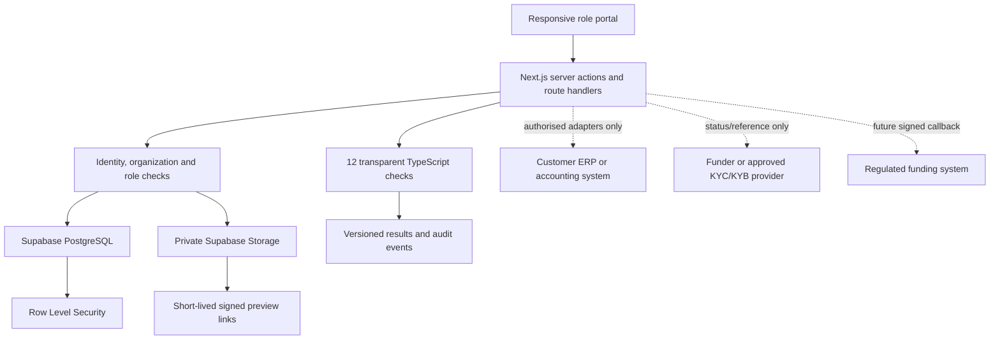

# Current ProofFlow architecture

This document is the source of truth for the submitted architecture. The chronological implementation log contains earlier prototypes; those entries are history, not the current design.

## Product shape

ProofFlow is one web application with three secure portal views:

| Portal | Primary responsibility | Important features |
|---|---|---|
| SME | Build a trustworthy invoice evidence package | Application journey, three private documents, manual evidence entry, 12 transparent checks, customer-confirmation status, proposal response and Trust Passport |
| Large customer | Confirm or dispute that the transaction is real and unpaid | Confirmation queue, six-question declaration, captured signature, read-only receipt and downloadable certificate |
| Funder / Bank | Review the evidence and make an independent funding decision | Read-only evidence package, customer certificate, external KYC/KYB progress, audit trail, proposal or decline |

The portals are not separate products. They read the same application and audit history while server and database rules decide what each organization can see or change.

## System view

## Evidence journey

1. The SME creates an application with the customer, invoice value and expected payment date.
2. The SME uploads one purchase order, one delivery record and one invoice to private storage.
3. ProofFlow prepares a fixed set of 21 fields. The SME reads the documents and enters the values exactly as shown.
4. The server validates that the complete expected payload and declaration are present.
5. One database transaction saves all values, their source document, the user and timestamps. A partial submission cannot advance the application.
6. ProofFlow runs 12 transparent checks covering names, references, currency, totals, arithmetic, date order, duplicate files, duplicate invoice numbers, delivery acknowledgement and customer confirmation.
7. The large customer confirms or disputes six transaction facts. A completed confirmation becomes a read-only receipt and PDF certificate.
8. Eligible funders can read the completed package. They perform KYC/KYB and underwriting outside ProofFlow, recording only limited progress metadata.
9. The funder independently records a proposal or decline. Accepting a proposal does not claim that money moved.

Read [VERIFICATION-CHECKS.md](VERIFICATION-CHECKS.md) for the exact meaning of the 12 checks.

## Server and data responsibilities

| Component | Responsibility | Does not do |
|---|---|---|
| Next.js interface | Role-aware pages, forms, loading/error states and PDF routes | Decide access based only on hidden buttons |
| Server actions | Validate input, verify role, call database functions and refresh state | Trust browser-supplied organization ownership |
| PostgreSQL functions | Atomic evidence submission and guarded state transitions | Accept incomplete evidence writes |
| Row Level Security | Enforce tenant and role visibility below the application | Replace server-side checks |
| Private storage | Store documents under controlled application paths | Expose public evidence URLs |
| Document checks | Produce repeatable pass, review or fail results with compared values | Produce a credit score or approve funding |
| Customer confirmation | Record an authenticated declaration and issue evidence of that declaration | Guarantee payment |
| External-compliance panel | Coordinate provider, reference and progress | Store ID documents, biometrics or confidential screening reports |
| Funding proposal | Record the funder's terms and the SME response | Lend, hold funds or confirm settlement |

## Access matrix

| Resource/action | SME | Large customer | Funder / Bank |
|---|:---:|:---:|:---:|
| Own application and private documents | Read/write during allowed stages | Only when required for an assigned confirmation | Read-only after customer evidence is complete |
| Manual evidence entry | Submit for own application | No | No |
| Document-check results | Read | Read for assigned request | Read for eligible package |
| Customer declaration | Read result | Submit once, then read-only | Read result and certificate |
| External KYC/KYB progress | Read relevant status | No | Create/update for its review |
| Funding proposal | Accept/decline its proposal | No | Create or decline independently |

Every protected operation repeats authorization on the server. Row Level Security remains the final database boundary.

## Certificate lifecycle

The customer certificate is not uploaded or manually fabricated:

1. an authenticated large-customer representative answers six questions;
2. `No` answers require an explanation;
3. the representative reviews the answers, provides job title and signature, and accepts a versioned declaration;
4. the database records the immutable decision, actor, time, approval ID, transaction snapshot and payload hash;
5. an authorized PDF route renders that stored record with a verification link;
6. SME, customer and eligible funder can view or download it according to their permissions.

The certificate proves who confirmed which facts at what time. It does not guarantee payment or funding.

## Integration boundaries

ProofFlow prefers an authorised customer-system connection when a real contract and credentials exist. If none exists, the product uses authenticated customer confirmation. It never invents an SAP, Coupa, bank or compliance response.

KYC/KYB and underwriting remain external. A provider-neutral status model allows different approved partners without copying their confidential identity evidence into ProofFlow. Disbursement requires a future signed funding-partner callback plus reconciliation.

## Legacy compatibility

Some applied database enum values, columns, functions and historical audit action names contain terms from earlier prototypes. Removing them destructively would break migration history and existing records. They are treated as storage compatibility only:

- current routes expose no AI document processing;
- server execution for the former simulated disbursement function is revoked;
- current UI maps historical audit identifiers to accurate product language;
- the final migrations remove old test integrations and normalize submission records.

New code must use the current manual-evidence, customer-confirmation, external-compliance and funding-proposal boundaries.
