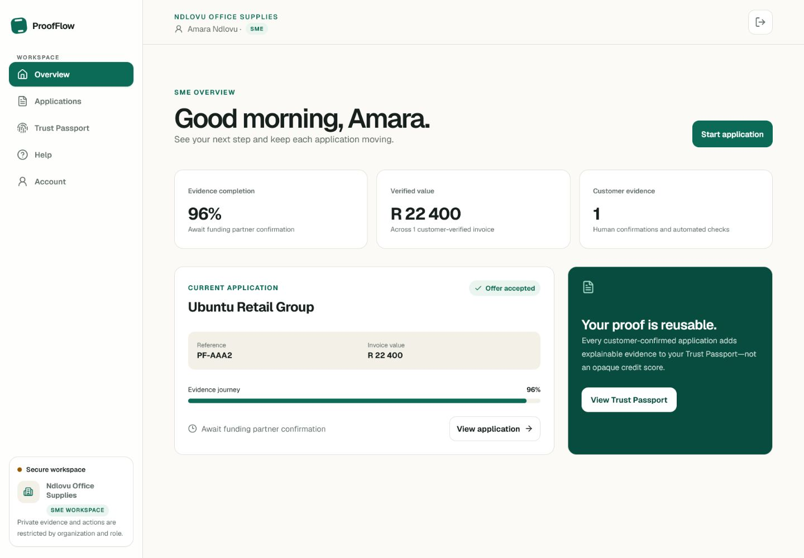
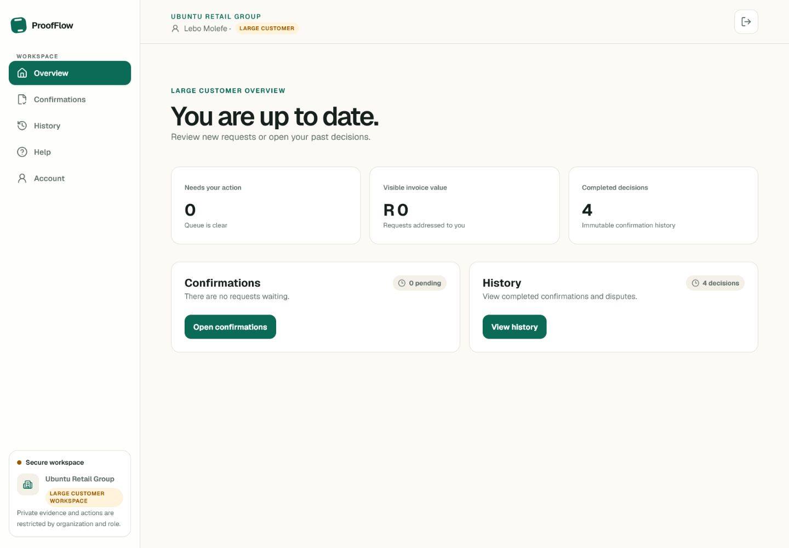
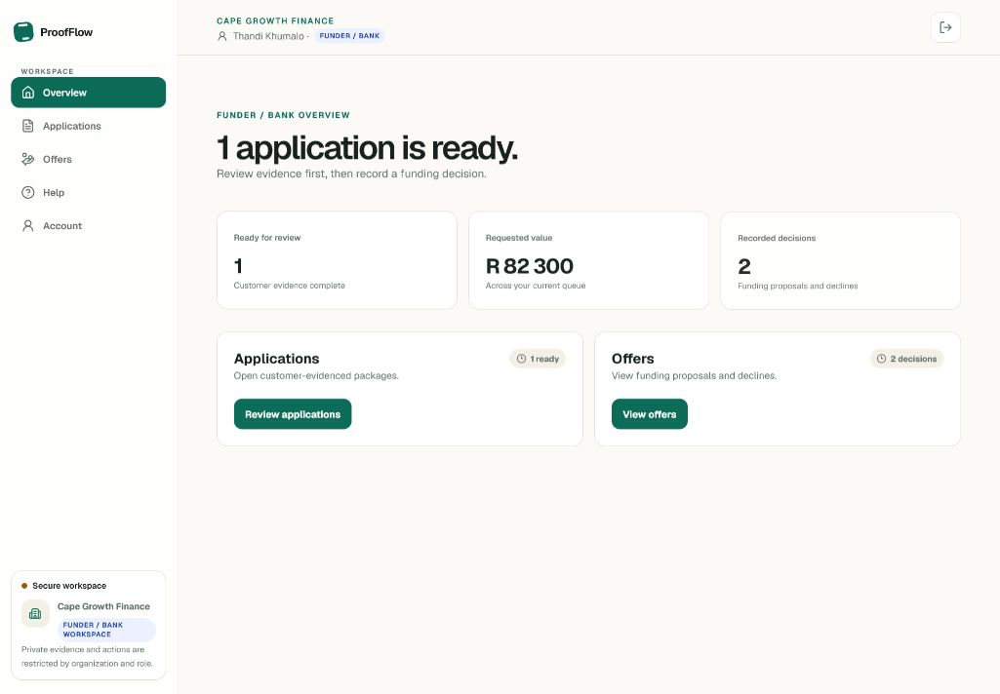
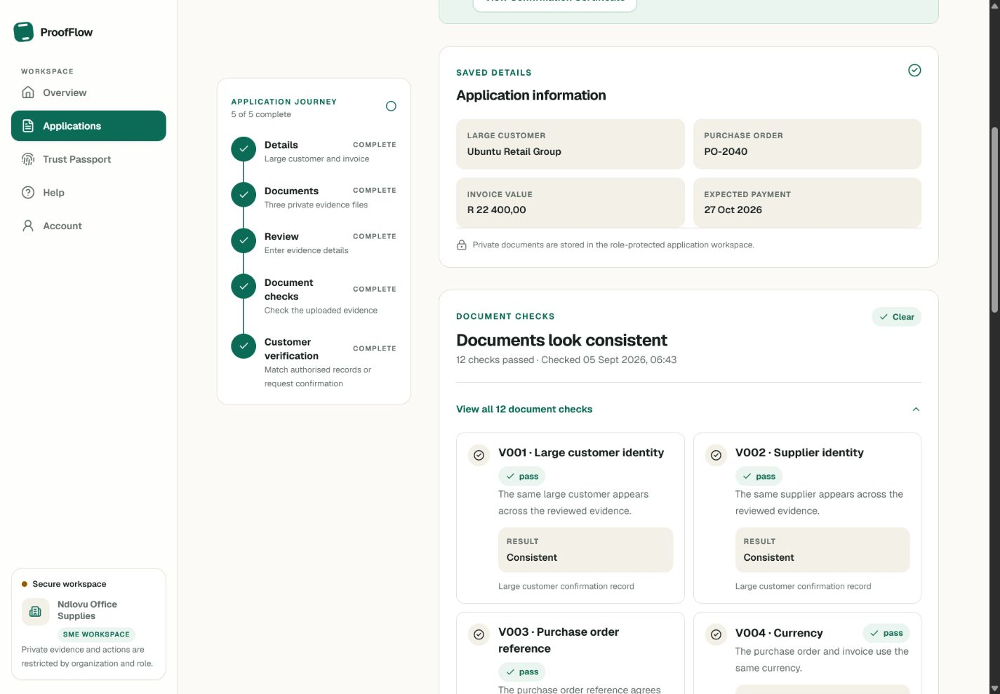
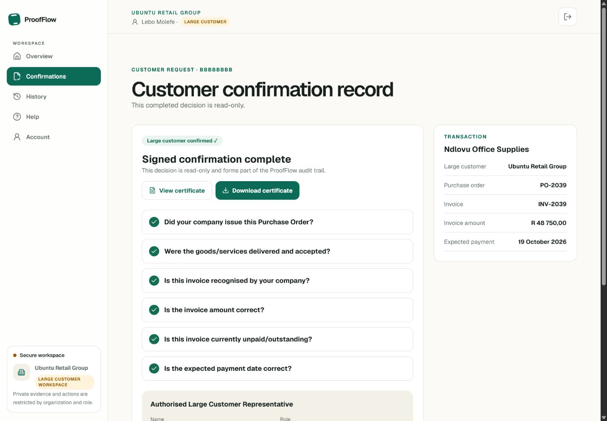
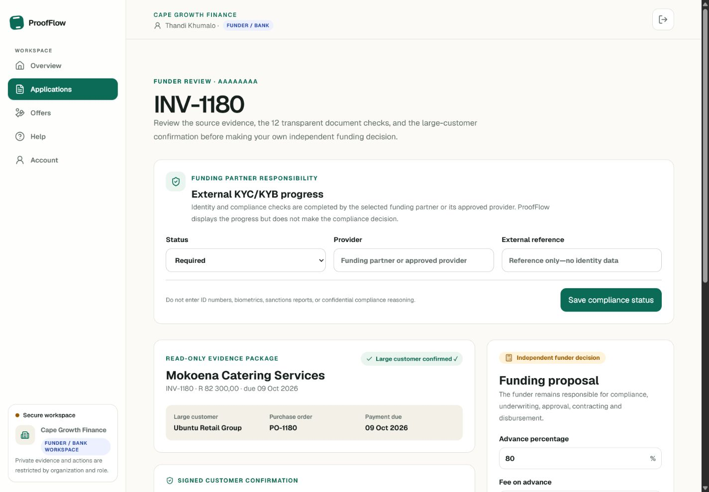

# ProofFlow feature guide

This is the visual tour for judges and reviewers. The screenshots come from the deployed application using fictional testing accounts.

## One product, three accountable portals

The same invoice application moves between three organizations. Each portal exposes only the information and actions needed for that role.

### SME portal

The SME can:

- create and resume invoice-finance applications;
- upload a purchase order, delivery record and invoice privately;
- enter 21 required facts while viewing their source document;
- run 12 transparent document checks;
- request and track customer confirmation;
- review funding proposals and build an evidence-based Trust Passport.

### Large-customer portal

The large customer can:

- open only confirmation requests addressed to its organization;
- answer six clear transaction questions;
- explain disputes, review answers and sign a declaration;
- revisit read-only confirmation or dispute history;
- view and download the confirmation certificate.

### Funder / Bank portal

The funder can:

- review only packages that have eligible customer evidence;
- inspect source facts, check results, the customer decision and audit history;
- record external KYC/KYB progress without uploading identity evidence;
- create a transparent proposal or decline independently;
- leave contracting and disbursement in its regulated funding system.

## Twelve checks, explained rather than scored

ProofFlow compares customer and supplier names, order references, currency, amounts, arithmetic and date order. It also checks delivery acknowledgement, exact file duplicates, repeated invoice identities and customer confirmation. A check shows the actual values and why it passed, needs review or failed. The V001–V012 codes are only audit labels.

Read [VERIFICATION-CHECKS.md](VERIFICATION-CHECKS.md) for every comparison and an example.

## How the confirmation certificate is issued

The certificate is generated from a completed, authenticated decision:

1. the large-customer representative answers six questions;
2. any dispute requires an explanation;
3. the representative reviews the answers, enters a job title, signs and accepts a versioned declaration;
4. the database stores the decision, transaction snapshot, actor, timestamp, approval ID and payload hash;
5. an authorized server route renders the PDF and verification link;
6. the SME, customer and eligible funder may view or download it.

It records who confirmed what and when. It does not guarantee payment.

## Funder responsibility remains visible

ProofFlow helps the funder understand the transaction; it does not assume the funder's risk. The funding partner performs KYC/KYB, underwriting, approval, contracting and disbursement. ProofFlow coordinates limited status and evidence so responsibility stays clear.

## Sample documents for testing

The repository includes fictional [sample documents for testing](../samples/sample-documents-for-testing/README.md):

- a consistent set for the normal path;
- a mismatch set that triggers clear explanations;
- a byte-identical set that demonstrates renamed-file duplicate detection.

These documents make the workflow reproducible without exposing real financial or customer information.
